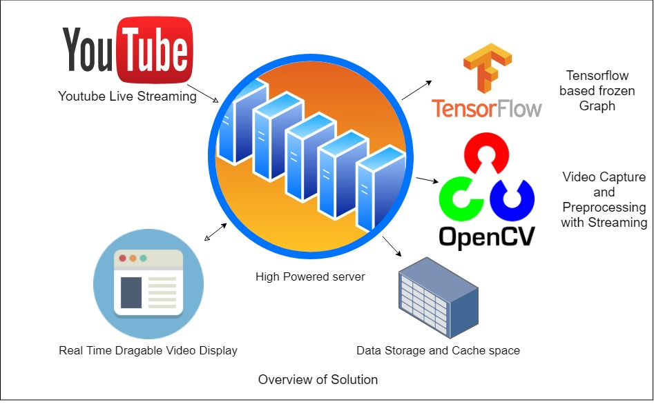

# Bootstrap Paradox Hackathon
 Background Removal for Unacadamy

The solution aspires to be Live video display tool that enables Unacademy users to have a non-intrusive Draggable Video Interface which can be deployed over a high-powered server so as to deliver a smooth viewing experience to the user, by handling all of the live stream handling in the server itself.
The solution will be a POC of the actual implementation which will be able to handle Live Videos (from YouTube) as well as static ones. It also caches the processed video so as to make the experience faster for the next time it is streamed, thereby delivering a better experience for the users.
Due to lack of a proper high power computing device, the actual deliverable will be way slower, but with proof that it can be implemented in a production environment with a drastic increase in performance.
The solution is based on Tensorflow and OpenCV with a python (Flask) based server

## Instructions
 - [X] Install Python 
 - [X] Install the following packages using Pip : flask, pafy, youtube-dl, tensorflow, opencv-python, pillow
 - [X] download the model files from the url [Drive Link](https://drive.google.com/drive/u/0/folders/18-7qTKQWR3470GytQueJKJtbDwipx41U) into the solution folder
 - [X] Run the server.py file and access the [localhost](http://localhost:5000/)
 - [X] The Live stream of data from the news channel will appear on the screen without the background
